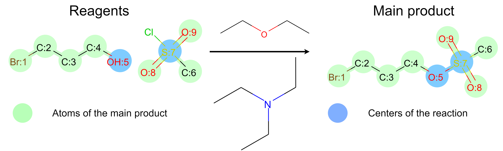
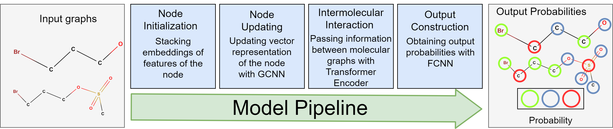
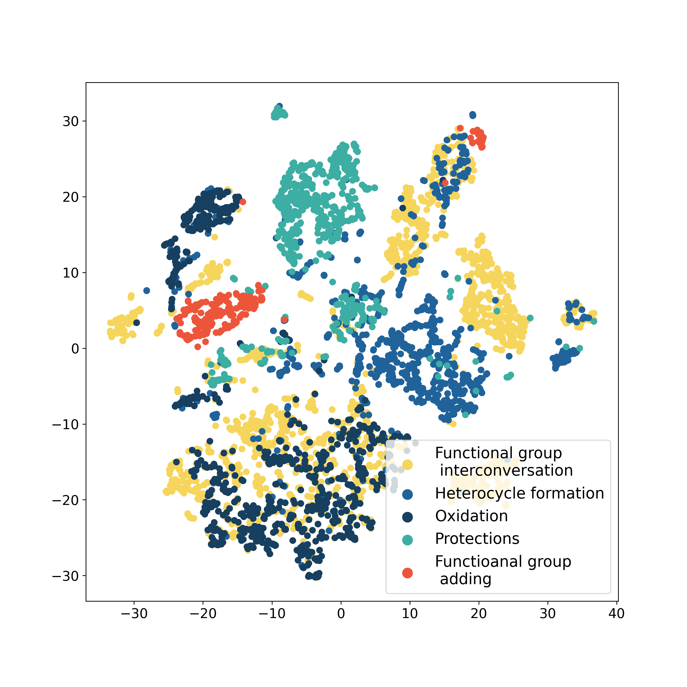

# DRACON: Disconnected Graph Neural Networkfor Atom Mapping in Chemical Reactions

This repository is an author's implementation of the paper DRACON: Disconnected Graph Neural 
Networkfor Atom Mapping in Chemical Reactions


## Overview

We propose a model that affords both predicting reaction outcomes and finding atom mapping at the 
same time. Two specific tasks are solved in parallel (see Fig.~\ref{fig:reaction}). Atoms of the 
main product and reaction centers are found. Centers of the reaction are atoms of the main product.
The atoms change their configuration during the reaction. The configuration of an atom is an 
aggregate of characteristics of the atom and adjacent bonds. In terms of graph theory, both tasks 
are node-classification in a disconnected graph of reactant and product molecules. The novel 
*D*isconnected G*r*aph *A*ttention *Con*volution  neural network
(DRACON) solves the node-classification tasks. Atoms of the main product and centers of the 
reaction determine the outcome in the majority of reactions. 


The overall model pipeline consists of four blocks. Firstly, each 
atom is mapped to a real vector according to its characteristics in the molecule. The model uses 
numerical characteristics of atoms. Secondly, the vectors are updated with Relational Graph 
Convolution Neural Network (RGCNN). The RGCNN generalizes Graph 
Convolution Neural Network for graphs with different edge types that correspond 
to chemical bonds. In this work, we use extended molecular graphs with molecules' and reaction's 
level nodes to pass information across different molecules. Then, the 
Transformer encoder processes the vectors. The block simulates intermolecular interaction, which is 
a mechanism of chemical reactions. Finally, the fully-connected neural network (FCNN) gives 
probabilities for each atom in the node classification problems.


Compared with other works, DRACON has several novel aspects in terms of neural network architecture. 
DRACON generalizes the graph convolution neural network for the disconnected molecular graphs. The 
natural structure of the DRACON is suitable to add features of molecules, atoms like valencies, 
hybridization, types of chemical bonds, etc.   
 
The authors investigate vector representations of reactions. The best model demonstrates that 
pseudo-nodes in the extended graph of source molecules learn chemical information about the whole 
reaction. Similar representation correspond chemical reactions which have a similar mechanism.  
 
 
The model analysis illustrates that it gains substantial chemical insight, and one could 
differentiate and group chemical reactions by their types in a fully unsupervised fashion
 
 
 
 ## Requiremnts
 
 Linux machine with Nvidia-1080Ti, Python 3.7.7 was used for the experiments with the folowing
  packages:
 
 ```
dgl-cu101==0.4
Django==3.0.7
matplotlib==3.2.1
numpy==1.18.2
pandas==1.0.3
PyYAML==5.3.1
scikit-learn
scipy
seaborn==0.10.0
torch==1.4.0
tqdm==4.45.0
rdkit
```

 ## Data preprocessing
 Our custom data preprocessor takes pandas dataframes stored in pickle. The dataframes should consist column 'smarts' 
 with canonical reactions, and different other columns which will be stored in the processed dataset. 
 
 To create dataset, you should use the following commands:
 
 ```
cd scripts
python -u process_dataset.py --raw_dataset 'path to raw pickles directory' --save_path 'save directory'
```
 
 ## Training
 
 To train a model, you should use the following commands:
  ```
cd scripts
python -u experiment.py --config path to YAML configuration --device name of using device
```

Examples of ```.yml``` configurations are in ```experiments``` directory.
 
 ## Online demo
 
We created an online demo which source code is in ```server``` directory. The demo is available at http://93.175.29.159:8000/.